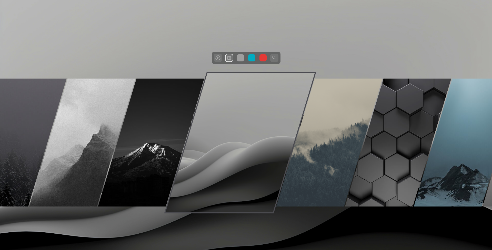
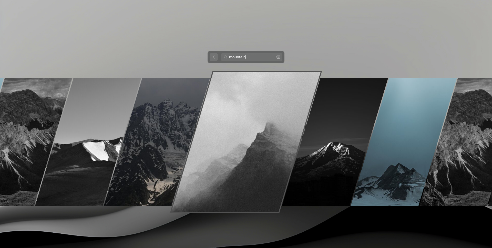
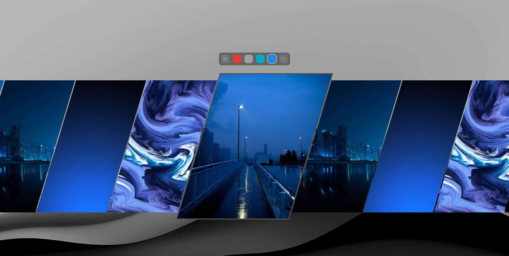

# HyprQuickPaper GNOME

A lightweight visual wallpaper selector for GNOME, designed for fast keyboard-driven navigation through large wallpaper collections.

The project provides a standalone GNOME implementation inspired by the workflow and visual approach of [HyprQuickPaper](https://github.com/ilyamiro). It is independently implemented with Python, GTK 4, and PyGObject.

## Features

- Fast keyboard-optimized wallpaper navigation
- Selected wallpaper remains highlighted while other wallpapers stay visible
- Supports large wallpaper collections
- Filename search
- Visual color filtering
- Mouse selection and navigation
- GNOME keyboard shortcut integration
- Applies the selected wallpaper through GNOME's desktop background settings

## Screenshots

### Wallpaper Selector



### Search



### Color Filter



## Requirements

- Python 3
- GTK 4
- PyGObject
- Pycairo
- `jq`
- ImageMagick
- GNOME `gsettings`

#### Fedora

```bash
sudo dnf install \
    gtk4 \
    python3-gobject \
    python3-cairo \
    glib2 \
    jq \
    ImageMagick
```

#### Ubuntu / Debian

```bash
sudo apt update
sudo apt install \
    python3 \
    python3-gi \
    python3-cairo \
    python3-gi-cairo \
    gir1.2-gtk-4.0 \
    libglib2.0-bin \
    jq \
    imagemagick
```

#### Arch Linux

```bash
sudo pacman -S \
    gtk4 \
    python-gobject \
    python-cairo \
    glib2 \
    jq \
    imagemagick
```

Other distributions may require equivalent packages, including GdkPixbuf and GTK 4 introspection data.

## Installation

Clone the repository and run the installer:

```bash
git clone https://github.com/hugo-sants/hyprquickpaper-gnome.git
cd hyprquickpaper-gnome
make install
```

The application is installed to:

```text
~/.local/share/hyprquickpaper-gnome
```

The installer asks where your wallpapers are stored and which GNOME keyboard shortcut should open the picker.

The default shortcut is:

```text
Super+W
```

GNOME accelerator syntax can also be used, for example:

```text
<Super>w
<Super><Alt>w
```

The installer preserves existing custom shortcuts.

The shortcut created by the installer points to the installed application rather than the source directory.

## GNOME Keyboard Shortcut

After installation, the shortcut can be changed from:

*Settings → Keyboard → View and Customize Shortcuts → Custom Shortcuts → HyprQuickPaper GNOME*

#### Keyboard and Mouse Controls

| Action | Default |
| --- | --- |
| Next | `J` / `Right Arrow` |
| Previous | `K` / `Left Arrow` |
| Jump forward | `D` |
| Jump backward | `U` |
| Apply | `Enter` / `Space` |
| Exit | `Esc` |
| Mouse selection | Click wallpaper |
| Horizontal navigation | Mouse wheel |
| Horizontal scrolling | Left mouse drag |

#### Search

The search interface allows wallpapers to be filtered by filename.

Search results remain active until the Back button is used.

| Action | Default |
| --- | --- |
| Next | `J` / `Right Arrow` |
| Previous | `K` / `Left Arrow` |
| Jump forward | `D` |
| Jump backward | `U` |
| Apply | `Enter` / `Space` |
| Leave search field | `Esc` |
| Close search | Back button |

Pressing `Esc` leaves the search field while keeping the current results visible.

The Back button closes the search and restores the filter interface.

## Color Filter

The color filter provides a visual way to narrow the wallpaper collection.

Only color groups that actually exist in the current wallpaper collection are displayed.

## Uninstallation

To remove the installed application:

```bash
make uninstall
```

This removes the installed application from:

```text
~/.local/share/hyprquickpaper-gnome
```

Wallpaper files themselves are not removed.